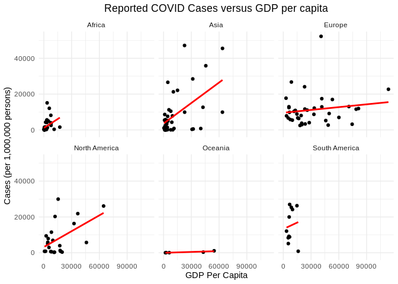
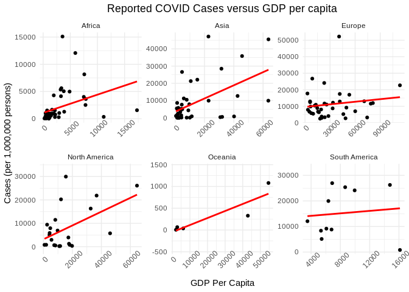

COVID19\_Report
================
Julian, Nabih, Nathan, and Yehya
20-10-2020

  - [Getting the Data and tidying the
    data](#getting-the-data-and-tidying-the-data)
  - [Join the Data](#join-the-data)

``` r
library(tidyverse)
```

    ## ── Attaching packages ────────────────────────── tidyverse 1.3.0 ──

    ## ✓ ggplot2 3.3.2     ✓ purrr   0.3.4
    ## ✓ tibble  3.0.3     ✓ dplyr   1.0.2
    ## ✓ tidyr   1.1.2     ✓ stringr 1.4.0
    ## ✓ readr   1.3.1     ✓ forcats 0.5.0

    ## ── Conflicts ───────────────────────────── tidyverse_conflicts() ──
    ## x dplyr::filter() masks stats::filter()
    ## x dplyr::lag()    masks stats::lag()

<!-- -------------------------------------------------- -->

*Background*: COVID-19 is a newly discovered (in 2019) virus in humans
that mainly attacks the respiratory system. It has been thought to have
mutated from the severe acute respiratory syndrome coronavirus 2
(SARS-CoV-2) virus. Some statistics about COVID-19 (according to the
CDC): around 14%-19% of people with COVID are hospitalized and 3%-5% of
people need to go to the ICU (Intensive Care Unit). The main reason for
its quick spread to a pandemic is the fact that it has an incubation
period of 2-14 days and many people do not develop symptoms during that
period. The risks from contracting COVID depend on age group and
pre-existing conditions. Older age groups and people with pre-existing
conditions are more likely to experience complications with COVID.

According to Our World in Data, countries with higher GDP tend to spend
more money on PPP and healthcare. This then begs the question, what is
the relationship between contraction/mortality rates of COVID-19 and the
GDP of a country. We have developed a hypothesis and aim to discover the
truth in this study.

<!-- -------------------------------------------------- -->

*Question*: We set out to answer the question of whether or not the per
capita GDP of nations around the world had any relationship with the
total number of reported cases (per million persons) of the respective
nations. We were wondering if the proportional wealth of each nation
could have an affect on the number of cases each nation has. We
hypothesized that if a country had more wealth per person that they
would most likely have access to better education and resources to
better prepare for a pandemic and thus would have fewer cases.

<!-- -------------------------------------------------- -->

*Data*:

# Getting the Data and tidying the data

<!------------------------------------------------------>

``` r
url_covid <- "https://raw.githubusercontent.com/owid/covid-19-data/master/public/data/owid-covid-data.csv"

## Set the filenames of the data to download
filename_covid <- "./data/covid_countries.csv"
filename_gdp <- "./data/gdp_countries.csv"

## Download the data locally
curl::curl_download(
        url_covid,
        destfile = filename_covid
)

## Loads the downloaded csv
df_covid_temp <- read_csv(filename_covid) %>% 
  select(iso_code, continent, date, total_cases, total_deaths, total_cases_per_million, total_deaths_per_million, population)

df_gdp_temp <- read_csv(filename_gdp) %>% 
  select("Country Name", "2019","Country Code")
##Rename columns:
df_gdp <- df_gdp_temp %>% 
  rename(
    iso_code = "Country Code",
    country = "Country Name",
    gdp = "2019"
    )
##Rename columns:
df_covid <- df_covid_temp %>% 
  rename(
    "cases" = total_cases,
    "deaths" = total_deaths,
    "cases_per1M" = total_cases_per_million,
    "deaths_per1M" = total_deaths_per_million
    )
```

# Join the Data

<!-- -------------------------------------------------- -->

\#\#We are going to calculate GDP per capita so that our measurements to
compare the countries are standardized, and we can get more “honest”
measurements and comparisons.

``` r
df_data_raw <-df_gdp %>%
            left_join(
              df_covid,
              by = "iso_code",
              na.rm = TRUE
            ) %>% 
              drop_na(gdp) %>% 
                drop_na(continent) %>% 
                  replace_na(list("cases" = 0, "deaths" = 0, "cases_per1M" = 0,  "deaths_per1M" = 0))

df_data_norm <- df_data_raw %>% 
                  mutate(gdpPerCap = (gdp/population), na.rm = TRUE) %>% 
                    select(continent, country, gdpPerCap, date, cases_per1M, deaths_per1M)
```

<!-- -------------------------------------------------- -->

*Graphs and Observations*

\[Insert Nathan’s graph\]

Above is another plot that shows the same data as the previous plot
broken apart by continent. There are several things that we noticed from
these graphs: - GDP’s are very different continent to continent, for
example Africa has much lower GDPs - In Europe and Asia where there is
the largest range of GDP’s there isn’t a clear relationship between GDP
and case counts

``` r
df_data_norm %>%
  filter(date == max(date)) %>% 
  ggplot(
    aes(gdpPerCap, cases_per1M)
  ) +
  geom_point() +
  stat_smooth(method="lm", se=TRUE, fill=NA,
                formula=y ~ poly(x, 1, raw=TRUE),colour="red") +
  facet_wrap(~ continent) +
  theme_minimal() +
  labs(
    x = "GDP Per Capita",
    y = "Cases (per 1,000,000 persons)"
  )
```

<!-- -->

The above plot shows the most recent total reported cases per 1 million
persons against the per capita GDP’s of the countries of the world. We
separated the countries into their respective continents and placed a
simple linear trend line to see if any possible relationships exist.
Upon initial glance, regions such as Asia, North America, and Europe
appear to have positive relationships even if they are more slight. But
for the other regions it is much more difficult to pick out if the data
points to an actual trend or not due to different ranges of values. So
we decided to try and reformat the plot to be more clear.

``` r
df_data_norm %>%
  filter(date == max(date)) %>% 
  ggplot(
    aes(gdpPerCap, cases_per1M)
  ) +
  geom_point() +
  stat_smooth(method="lm", se=TRUE, fill=NA,
                formula=y ~ poly(x, 1, raw=TRUE),colour="red") +
  facet_wrap(~ continent, scale = "free") +
  theme_minimal() +
  theme(
    axis.text.x = element_text(angle = 45)
  ) +
  labs(
    x = "GDP Per Capita",
    y = "Cases (per 1,000,000 persons)"
  )
```

<!-- -->

By allowing each cell’s axis-scaling to be different from one another,
we can now more clearly see relationships within each continent. It
appears that there are positive relationships in each region, meaning
that there appears to be a relationship between higher GDP per capita
and higher total reported cases. It is important to note that a fair
amount of variability exists in many of the regions and others like
Oceania have very few data points, so while there does appear to be
positive trends, we might require more data to find a more decisive
relationship.

<!-- -------------------------------------------------- -->

*Conclusion*

In general, when looking at our data, we can see that our hypothesis was
completely wrong. We believed that lower GDP would have a correlation to
higher cases/deaths due to COVID-19. Looking at our data we got to a
very different conclusion. When looking at the whole world, there
appears to be a trend that higher GDP leads to an average of more cases,
but then when broken down into continents we can see this conclusion
break completely. Besides that, when separated into continents we can
see how variable and different each continent was affected by the virus.
First of all we see how continents like Africa and South America have
extremely lower GDP than others like Asia, Europe, and North America,
and we also see how this doesn’t mean they have similar COVID-19 cases.
South America has much more cases, both in average and in total, even
though its GDP distribution is very similar to Africa.

Our belief is that this variability by country is due to three factors:
first, how well the continents and its countries reacted to the virus.
Second, how early the continent was hit (we can see that Asia has more
cases than North America, which might be because it was ground zero).
And third, how much travel to that continent occurs on a normal basis.
We believe that there is more transit between European countries than
there is between African countries, which might explain why Africa has
such a small number of cases.

It is also important to note that continents like Oceania and South
America (especially the first) are hard to compare against others
because of the small amount of data points we have for them, meaning
that they can become outliers much easier, and can lead to harder
conclusions.

In conclusion, that while we believe that there is a slight relationship
between GDP and the amount of cases from COVID-19 a country has, the
small relationship there might be is outweighed by other factors (such
as how the country reacted to the virus, or how much travel there
normally is to and from that country) making it close to insignificant
in determining the effect of COVID-19 on a country.

<!-- -------------------------------------------------- -->

*Questions for the future*

The above conclusions provide an answer to our hypothesis but they also
spur us towards other questions. Some of the questions and extensions
that we are interested in include: - Examining the relationship between
gdp per capita at a state and county level in the US. We are curious if
the trends we saw at a global level are also present at other
populations sizes. Are these trends consistent between different
countries? - What unites, if anything, the outliers in our gdp / covid
graph. For example maybe smaller or larger countries follow very
different trends. - Are there better metrics to look at how well
different nations dealt with COVID? For example, counting cases likely
exhibits lots of reporting bias etc. Maybe looking at inflation or gold
prices etc within a country could explain which countries were more
stable. - We were also interested in the death/case ratio, we plotted
that below

\[Insert graph here\]

This shows the number of reported deaths/cases ratio across different
GDP brackets. When compared to the case incidence rate there are some
interesting behaviors. - Overall the shape of the death/case curve is
very different than just the case curve - It appears that the 60-70,000
gdp bracket has the lowest average death/case rate even though they had
one of the higher case rates - The lower gdp brackets had low case
counts but higher deaths/case - This leads to a larger design question
of whether deaths per case may be a better metric to evaluate how
countries were affected by the pandemic rather than just reported cases
